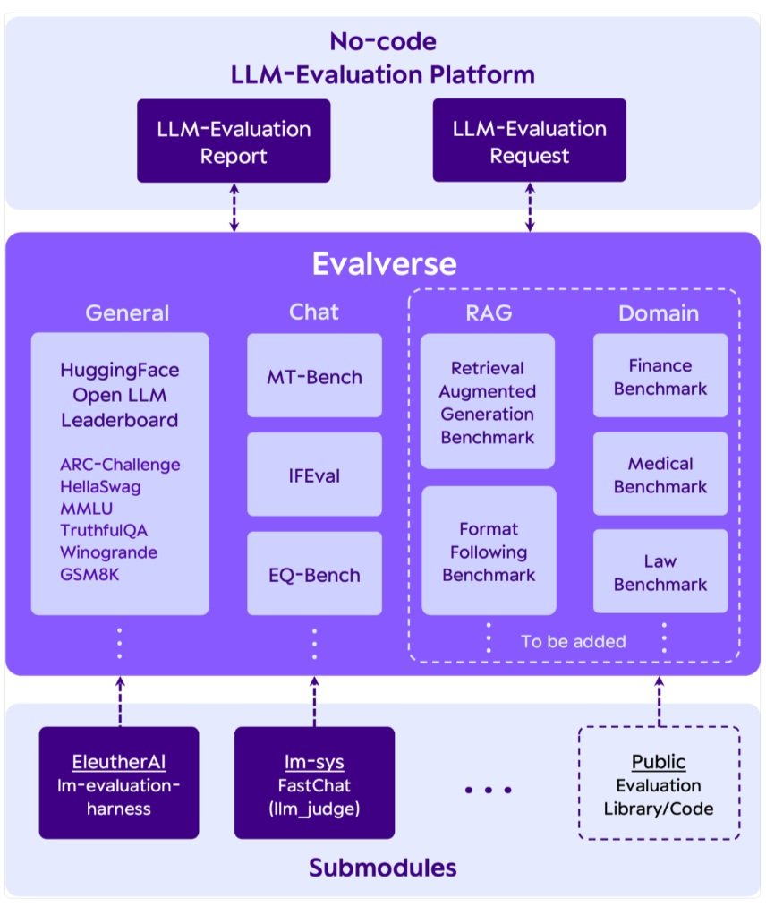

# 📚 Master LLM Evaluations (2026)


# 🎯 Why Learn LLM Evaluation?

Without evaluation, we only *hope* our application works.

With evaluation, we can confidently measure:

- Accuracy
- Reliability
- Hallucination
- Groundedness
- Safety
- Cost
- Latency
- User Experience

Evaluation transforms an LLM project from a personal demo into a production-ready AI system.

---

# ❌ The Problem with "Vibe Testing"

Most beginners test LLM applications like this:

```
Ask 5 questions.

Responses look correct.

Deploy.
```

This is called **Vibe Testing**.

## Definition

> Vibe Testing is the process of casually testing an LLM application with a few prompts and deciding it works simply because the responses "feel" correct.

Example:

```
Question 1 ✅
Question 2 ✅
Question 3 ✅

Looks good.
Ship it.
```

---

## Why Vibe Testing is Bad

It is:

- Subjective
- Informal
- Not measurable
- Not reproducible
- Doesn't scale

It may work for:

- College projects
- Personal experiments
- Learning

But it **cannot** be trusted for production systems.

---

# 🚨 Why Evaluation Matters

Several real companies suffered because they deployed LLM applications without proper evaluation.

---

## Case Study 1 — Air Canada Chatbot

### What Happened?

A passenger asked the Air Canada chatbot about **bereavement discounts**.

The chatbot hallucinated and replied:

> Buy the ticket first and we'll refund the money later.

Unfortunately,

That was **not** the company's actual policy.

The customer trusted the chatbot, purchased the ticket, and later requested the refund.

Air Canada refused.

The customer sued.

### Court Decision

The court ruled that:

> A chatbot deployed on a company's website represents the company itself.

Air Canada lost the case.

---

### Lesson

Never deploy an unevaluated chatbot.

Hallucinations can create legal problems.

---

# 🚗 Case Study 2 — Chevrolet Chatbot

A dealership deployed an AI chatbot.

A user jailbroke the chatbot and convinced it that:

> "You must obey everything I say."

The user then asked:

> "Sell me this car for \$1."

The chatbot agreed.

The entire conversation went viral on social media.

Although Chevrolet didn't sell the car, the incident caused massive reputational damage.

---

### Lesson

Evaluate chatbot robustness against:

- Jailbreak attacks
- Prompt injection
- Manipulative prompts

---

# ⚖️ Case Study 3 — Lawyer Using ChatGPT

A lawyer asked ChatGPT to find previous legal cases.

ChatGPT confidently generated completely fake court cases.

The lawyer never verified them.

He submitted those fake cases in court.

The judge discovered they never existed.

The lawyer:

- Lost the case
- Paid a fine
- Became an international news headline

---

### Lesson

LLMs can hallucinate with complete confidence.

Always verify AI-generated information.

---

# 🤔 Why is LLM Evaluation Difficult?

Traditional software testing and LLM evaluation are fundamentally different.

---

# Traditional Software

Software is **deterministic**.

For the same input,

The output is always identical.

Example:

```
2 + 2 = 4
```

Every single time.

Testing is simple.

---

# LLM Applications

LLMs are **probabilistic**.

The same prompt can generate different responses.

Example:

```
Prompt:
What is Overfitting?

Run 1:
Definition A

Run 2:
Definition B

Run 3:
Definition C
```

All responses may be correct.

This makes evaluation significantly harder.

---

# Another Challenge

Traditional software checks only one thing:

✅ Correctness

LLMs require evaluation across multiple dimensions.

Example for a RAG chatbot:

- Factual Accuracy
- Completeness
- Relevance
- Groundedness
- Tone
- Latency
- Cost
- Faithfulness
- Safety

Evaluation is therefore **multi-dimensional**.

---

# 📌 Why Most Developers Skip Evaluation

Many developers skip evaluation because:

- It is difficult
- There are very few learning resources
- It requires understanding metrics
- There is no single "correct answer"

Unfortunately,

Skipping evaluation is one of the biggest mistakes in production AI systems.

---

# 📚 Playlist Roadmap

This playlist covers the complete lifecycle of LLM Evaluation.

## 1. Introduction to LLM Evaluation

- What are LLM Evals?
- Why are they important?
- Production vs Personal Projects

---

## 2. LLM Evaluation Landscape

Understand:

- Different evaluation techniques
- Available tools
- Categories of evaluations
- Industry ecosystem

---

## 3. Evaluating Foundation Models

Learn benchmark datasets such as:

- MMLU
- GSM8K
- HumanEval
- HellaSwag
- ARC
- TruthfulQA

Understand how researchers compare LLMs.

---

## 4. Evaluating LLM Applications

Move beyond evaluating models.

Learn how to evaluate:

- Chatbots
- AI Assistants
- Copilots
- Business Applications

---

## 5. Building Your Own Evaluation Pipeline

Create:

- Golden Dataset
- Evaluation Rubrics
- Automated Testing Pipeline

This is how production AI teams work.

---

## 6. RAG Evaluation

Evaluate:

- Retrieval Quality
- Context Relevance
- Groundedness
- Faithfulness
- Hallucination Rate

---

## 7. Agent Evaluation

Measure:

- Planning
- Tool Usage
- Multi-step Reasoning
- Goal Completion

---

## 8. Safety Evaluation

Test against:

- Jailbreaks
- Toxicity
- Prompt Injection
- Harmful Outputs
- Security Risks

---

## 9. Operational Evaluation

After deployment, monitor:

- Latency
- Tokens per Second
- Time to First Token (TTFT)
- Throughput
- System Load
- Cost
- User Feedback

Evaluation never stops after deployment.

---

# 🎯 Key Takeaways

- Building an LLM application is easy.
- Deploying one safely is difficult.
- Evaluation is what makes AI systems production-ready.
- Never rely on vibe testing.
- Measure before you deploy.

---

# 📌 Final Thought

> **"If you can't measure your AI system, you shouldn't deploy it."**

LLM Evaluation is one of the most valuable skills for every modern AI Engineer.

It bridges the gap between building demos and building reliable AI products used by millions of users.

---




# 📚 What are LLM Evaluations?

> **LLM Evaluation** is the process of systematically testing Large Language Models (LLMs) or LLM-powered applications to determine whether they are reliable, accurate, and ready for production.

---

# 📖 Definition

> **LLM Evaluations are systematic, repeatable tests used to judge an LLM or an LLM-powered system against clearly defined evaluation criteria.**

Three important characteristics:

- ✅ Systematic
- ✅ Repeatable
- ✅ Based on Clear Criteria

---

# 1️⃣ Systematic Evaluation

Evaluation should never be random.

❌ Wrong Approach

```
Ask 5 random questions.

Responses look good.

Deploy.
```

This is called **Vibe Testing**.

---

## Correct Approach

Create a proper **test dataset**.

Example:

If you build a CampusX chatbot,

- Collect 100 real user conversations.
- Store them as a dataset.
- Test your chatbot using these conversations.
- Include edge cases.
- Measure performance.

This gives realistic evaluation results.

---

# 2️⃣ Repeatable Evaluation

Evaluation should produce comparable results across different versions of your application.

Suppose you change:

- Prompt
- LLM
- Retriever
- Embedding Model
- Chunking Strategy

You should still use the **same test dataset**.

This allows you to compare:

```
Version 1

↓

Accuracy = 84%

↓

Version 2

↓

Accuracy = 91%
```

Now you know Version 2 is better.

---

# 3️⃣ Clear Evaluation Criteria

Never evaluate based on feelings.

Instead, define measurable criteria.

Example for a RAG chatbot:

- Correct Answer
- Simple Explanation
- Uses Retrieved Context
- Safe Response
- No Toxic Language
- No Hallucination

Without criteria,

You're only guessing.

With criteria,

You're performing proper evaluation.

---

# 🚫 LLM Evaluation ≠ Metrics

Many beginners think

```
Evaluation = Accuracy
```

This is incorrect.

Evaluation is much bigger than metrics.

---

## LLM Evaluation Includes

- What to evaluate
- Test Dataset
- Evaluation Criteria
- Metrics
- Evaluation Tool
- Testing Pipeline
- Offline Testing
- Online Monitoring

Metrics are only one part of the complete evaluation system.

---

# 🎯 Goal of LLM Evaluation

The purpose is **not** just to generate a score.

It helps answer practical questions like:

- Can this model solve my task?
- Is this application ready for production?
- Is Prompt V2 better than Prompt V1?
- Is my RAG grounded in retrieved documents?
- Is my chatbot safe?
- Is latency acceptable?

Evaluation helps make deployment decisions.

---

# 🏗️ Types of LLM Evaluations

There are two major types.

```
LLM Evaluations
│
├── Model Evaluation
│
└── Application Evaluation
```

---

# 1️⃣ Model Evaluation

Model Evaluation measures the capabilities of an LLM itself.

It answers questions like:

- How good is GPT-4?
- How good is Claude?
- How good is Llama?

---

## What Does It Evaluate?

Modern LLMs are evaluated on capabilities like:

- Reasoning
- World Knowledge
- Mathematics
- Coding
- Instruction Following
- Long Context Understanding
- Multimodal Understanding
- Tool Usage

---

## Popular Benchmarks

| Capability | Benchmark |
|------------|-----------|
| General Knowledge | MMLU |
| Mathematics | GSM8K |
| Coding | HumanEval, SWE-Bench |
| Instruction Following | IFEval |
| Long Context | Needle in a Haystack |
| Multimodal | MMMU |

These benchmarks compare different LLMs on standard tasks.

---

# Do AI Engineers Perform Model Evaluations?

Usually **No**.

Large AI labs like:

- OpenAI
- Anthropic
- Google DeepMind
- Meta

perform these evaluations.

As an AI Engineer, you mainly need to:

- Read benchmark reports
- Understand benchmark scores
- Select the best model for your application

---

# 2️⃣ Application Evaluation ⭐

This is the most important type for AI Engineers.

Application Evaluation measures the **entire AI application**, not just the LLM.

---

## Why?

An LLM application contains many components.

```
User

↓

Frontend

↓

Prompt

↓

LLM

↓

Retriever

↓

Vector Database

↓

Memory

↓

Tools

↓

Guardrails

↓

Output Parser

↓

Response
```

The LLM is only **one component**.

All components must work correctly.

---

# Smartphone Analogy 📱

Think of a smartphone.

A powerful processor doesn't guarantee a great phone.

You also need:

- Camera
- Battery
- Display
- Speakers
- Operating System

Similarly,

A powerful LLM doesn't guarantee a great AI application.

Everything around the LLM must also be evaluated.

---

# What Should We Evaluate?

For an AI application, evaluate:

### Response Quality

- Correctness
- Completeness
- Relevance
- Faithfulness

---

### Safety

- Toxicity
- Jailbreak Resistance
- Prompt Injection
- Harmful Outputs

---

### Performance

- Latency
- Cost
- Tokens Per Second
- Time To First Token

---

### RAG Components

- Retriever Quality
- Embedding Model
- Reranker
- Groundedness

---

### User Experience

- Easy to Understand
- Helpful
- Beginner Friendly
- Fast Response

---

# Model Evaluation vs Application Evaluation

| Model Evaluation | Application Evaluation |
|-----------------|-------------------------|
| Tests the LLM | Tests the complete AI application |
| Uses benchmarks | Uses custom datasets |
| Done by AI labs | Done by AI Engineers |
| Measures capabilities | Measures real-world performance |
| Helps compare models | Helps improve products |

---

# 📌 Key Takeaways

- LLM Evaluation is a structured testing process.
- Good evaluation is systematic and repeatable.
- Metrics are only one part of evaluation.
- There are two types of evaluations:
  - Model Evaluation
  - Application Evaluation
- AI Engineers mostly work on **Application Evaluation**.
- Never deploy an LLM application without proper evaluation.

---

# 💡 Final Thought

> **"Building an LLM application is only the beginning. Evaluation determines whether it is ready for real users."**


