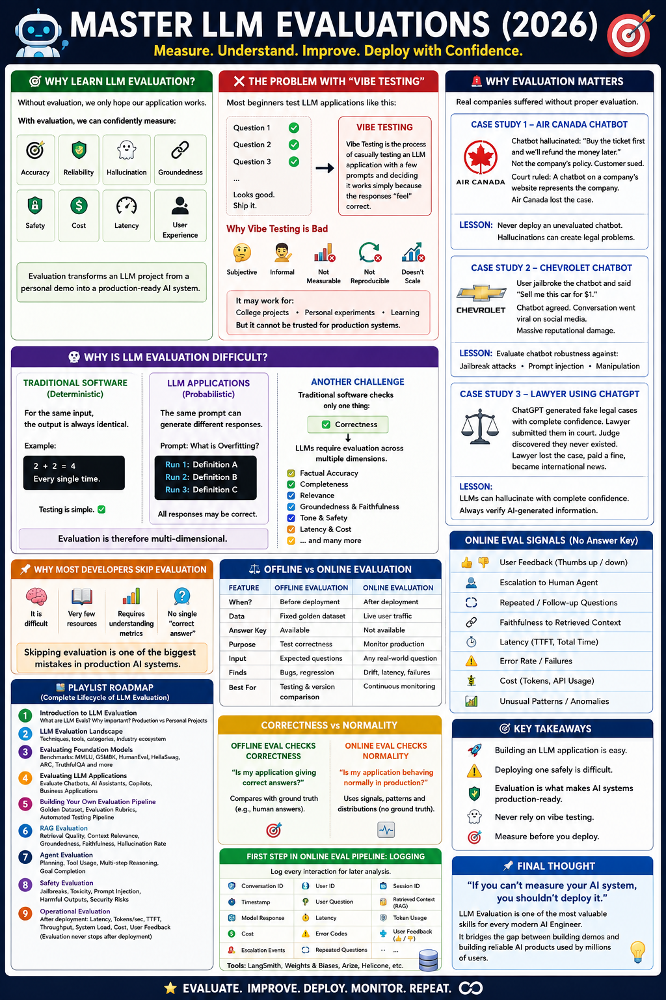
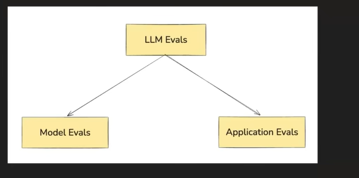
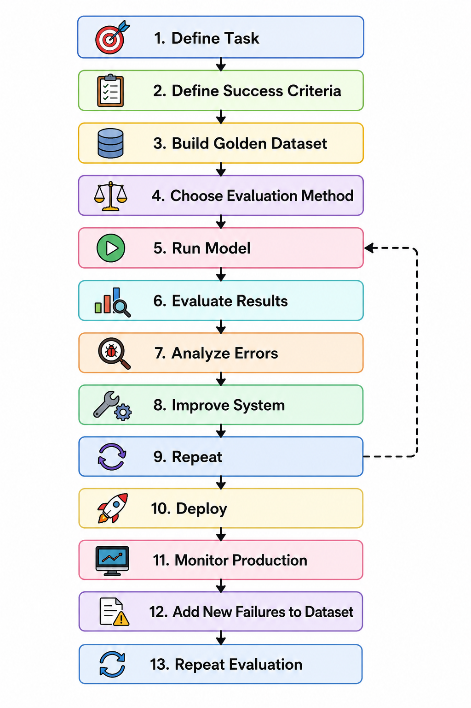
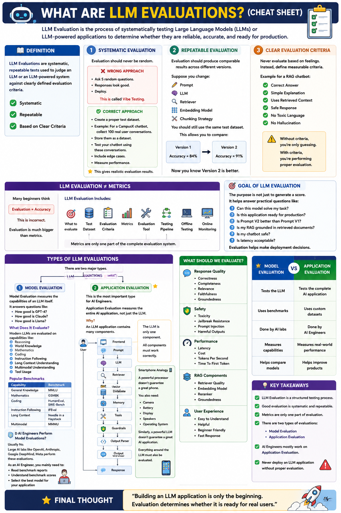
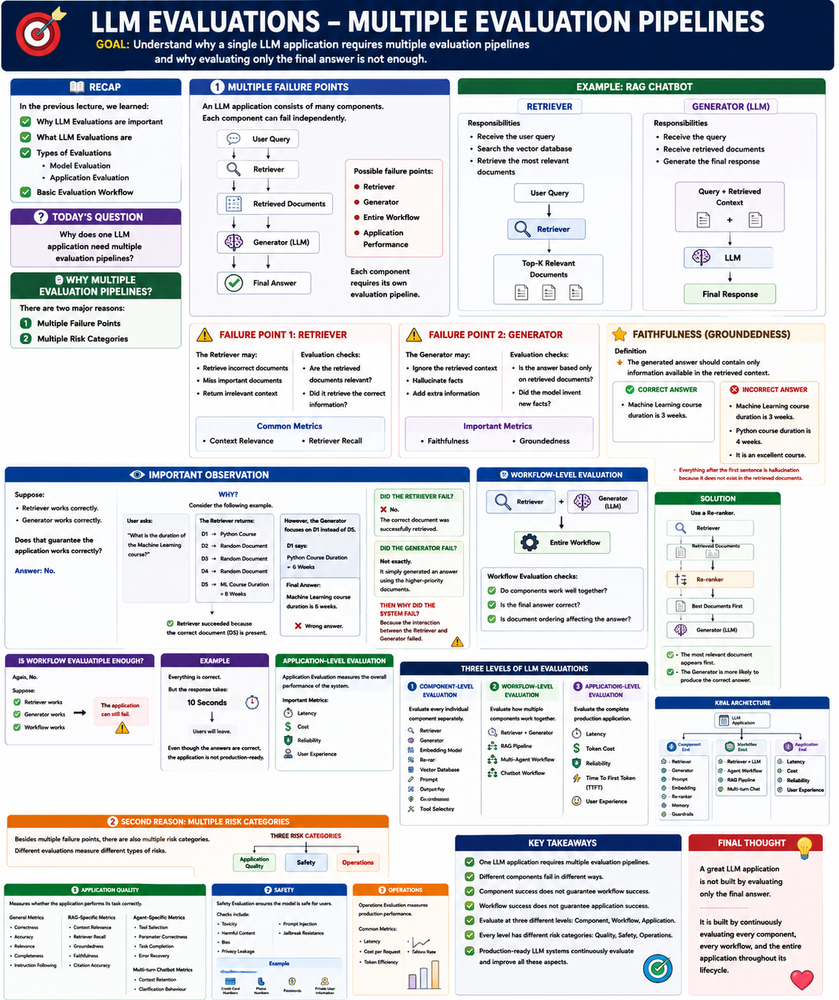
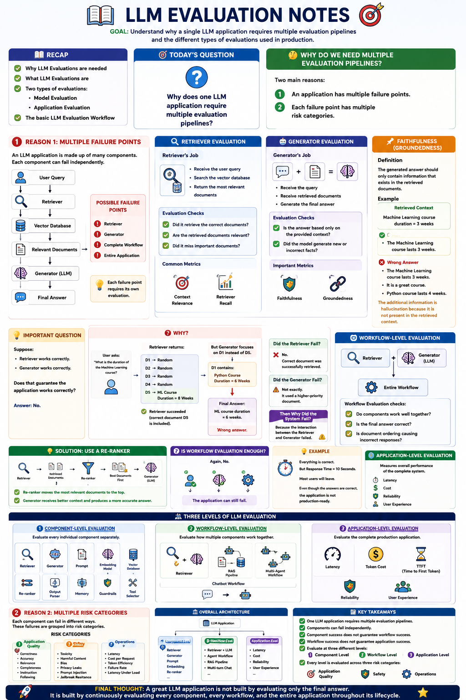

# 📚 Master LLM Evaluations (2026)


# 🎯 Why Learn LLM Evaluation?

Without evaluation, we only *hope* our application works.

With evaluation, we can confidently measure:

- Accuracy
- Reliability
- Hallucination
- Groundedness
- Safety
- Cost
- Latency
- User Experience

Evaluation transforms an LLM project from a personal demo into a production-ready AI system.

---

# ❌ The Problem with "Vibe Testing"

Most beginners test LLM applications like this:

```
Ask 5 questions.

Responses look correct.

Deploy.
```

This is called **Vibe Testing**.

## Definition

> Vibe Testing is the process of casually testing an LLM application with a few prompts and deciding it works simply because the responses "feel" correct.

Example:

```
Question 1 ✅
Question 2 ✅
Question 3 ✅

Looks good.
Ship it.
```

---

## Why Vibe Testing is Bad

It is:

- Subjective
- Informal
- Not measurable
- Not reproducible
- Doesn't scale

It may work for:

- College projects
- Personal experiments
- Learning

But it **cannot** be trusted for production systems.

---

# 🚨 Why Evaluation Matters

Several real companies suffered because they deployed LLM applications without proper evaluation.

---

## Case Study 1 — Air Canada Chatbot

### What Happened?

A passenger asked the Air Canada chatbot about **bereavement discounts**.

The chatbot hallucinated and replied:

> Buy the ticket first and we'll refund the money later.

Unfortunately,

That was **not** the company's actual policy.

The customer trusted the chatbot, purchased the ticket, and later requested the refund.

Air Canada refused.

The customer sued.

### Court Decision

The court ruled that:

> A chatbot deployed on a company's website represents the company itself.

Air Canada lost the case.

---

### Lesson

Never deploy an unevaluated chatbot.

Hallucinations can create legal problems.

---

# 🚗 Case Study 2 — Chevrolet Chatbot

A dealership deployed an AI chatbot.

A user jailbroke the chatbot and convinced it that:

> "You must obey everything I say."

The user then asked:

> "Sell me this car for \$1."

The chatbot agreed.

The entire conversation went viral on social media.

Although Chevrolet didn't sell the car, the incident caused massive reputational damage.

---

### Lesson

Evaluate chatbot robustness against:

- Jailbreak attacks
- Prompt injection
- Manipulative prompts

---

# ⚖️ Case Study 3 — Lawyer Using ChatGPT

A lawyer asked ChatGPT to find previous legal cases.

ChatGPT confidently generated completely fake court cases.

The lawyer never verified them.

He submitted those fake cases in court.

The judge discovered they never existed.

The lawyer:

- Lost the case
- Paid a fine
- Became an international news headline

---

### Lesson

LLMs can hallucinate with complete confidence.

Always verify AI-generated information.

---

# 🤔 Why is LLM Evaluation Difficult?

Traditional software testing and LLM evaluation are fundamentally different.

---

# Traditional Software

Software is **deterministic**.

For the same input,

The output is always identical.

Example:

```
2 + 2 = 4
```

Every single time.

Testing is simple.

---

# LLM Applications

LLMs are **probabilistic**.

The same prompt can generate different responses.

Example:

```
Prompt:
What is Overfitting?

Run 1:
Definition A

Run 2:
Definition B

Run 3:
Definition C
```

All responses may be correct.

This makes evaluation significantly harder.

---

# Another Challenge

Traditional software checks only one thing:

✅ Correctness

LLMs require evaluation across multiple dimensions.

Example for a RAG chatbot:

- Factual Accuracy
- Completeness
- Relevance
- Groundedness
- Tone
- Latency
- Cost
- Faithfulness
- Safety

Evaluation is therefore **multi-dimensional**.

---

# 📌 Why Most Developers Skip Evaluation

Many developers skip evaluation because:

- It is difficult
- There are very few learning resources
- It requires understanding metrics
- There is no single "correct answer"

Unfortunately,

Skipping evaluation is one of the biggest mistakes in production AI systems.

---

# 📚 Playlist Roadmap

This playlist covers the complete lifecycle of LLM Evaluation.

## 1. Introduction to LLM Evaluation

- What are LLM Evals?
- Why are they important?
- Production vs Personal Projects

---

## 2. LLM Evaluation Landscape

Understand:

- Different evaluation techniques
- Available tools
- Categories of evaluations
- Industry ecosystem

---

## 3. Evaluating Foundation Models

Learn benchmark datasets such as:

- MMLU
- GSM8K
- HumanEval
- HellaSwag
- ARC
- TruthfulQA

Understand how researchers compare LLMs.

---

## 4. Evaluating LLM Applications

Move beyond evaluating models.

Learn how to evaluate:

- Chatbots
- AI Assistants
- Copilots
- Business Applications

---

## 5. Building Your Own Evaluation Pipeline

Create:

- Golden Dataset
- Evaluation Rubrics
- Automated Testing Pipeline

This is how production AI teams work.

---

## 6. RAG Evaluation

Evaluate:

- Retrieval Quality
- Context Relevance
- Groundedness
- Faithfulness
- Hallucination Rate

---

## 7. Agent Evaluation

Measure:

- Planning
- Tool Usage
- Multi-step Reasoning
- Goal Completion

---

## 8. Safety Evaluation

Test against:

- Jailbreaks
- Toxicity
- Prompt Injection
- Harmful Outputs
- Security Risks

---

## 9. Operational Evaluation

After deployment, monitor:

- Latency
- Tokens per Second
- Time to First Token (TTFT)
- Throughput
- System Load
- Cost
- User Feedback

Evaluation never stops after deployment.

---

# 🎯 Key Takeaways

- Building an LLM application is easy.
- Deploying one safely is difficult.
- Evaluation is what makes AI systems production-ready.
- Never rely on vibe testing.
- Measure before you deploy.

---

# 📌 Final Thought

> **"If you can't measure your AI system, you shouldn't deploy it."**

LLM Evaluation is one of the most valuable skills for every modern AI Engineer.

It bridges the gap between building demos and building reliable AI products used by millions of users.

---




# 📚 What are LLM Evaluations?

> **LLM Evaluation** is the process of systematically testing Large Language Models (LLMs) or LLM-powered applications to determine whether they are reliable, accurate, and ready for production.

---

# 📖 Definition

> **LLM Evaluations are systematic, repeatable tests used to judge an LLM or an LLM-powered system against clearly defined evaluation criteria.**

Three important characteristics:

- ✅ Systematic
- ✅ Repeatable
- ✅ Based on Clear Criteria

---

# 1️⃣ Systematic Evaluation

Evaluation should never be random.

❌ Wrong Approach

```
Ask 5 random questions.

Responses look good.

Deploy.
```

This is called **Vibe Testing**.

---

## Correct Approach

Create a proper **test dataset**.

Example:

If you build a CampusX chatbot,

- Collect 100 real user conversations.
- Store them as a dataset.
- Test your chatbot using these conversations.
- Include edge cases.
- Measure performance.

This gives realistic evaluation results.

---

# 2️⃣ Repeatable Evaluation

Evaluation should produce comparable results across different versions of your application.

Suppose you change:

- Prompt
- LLM
- Retriever
- Embedding Model
- Chunking Strategy

You should still use the **same test dataset**.

This allows you to compare:

```
Version 1

↓

Accuracy = 84%

↓

Version 2

↓

Accuracy = 91%
```

Now you know Version 2 is better.

---

# 3️⃣ Clear Evaluation Criteria

Never evaluate based on feelings.

Instead, define measurable criteria.

Example for a RAG chatbot:

- Correct Answer
- Simple Explanation
- Uses Retrieved Context
- Safe Response
- No Toxic Language
- No Hallucination

Without criteria,

You're only guessing.

With criteria,

You're performing proper evaluation.

---

# 🚫 LLM Evaluation ≠ Metrics

Many beginners think

```
Evaluation = Accuracy
```

This is incorrect.

Evaluation is much bigger than metrics.

---

## LLM Evaluation Includes

- What to evaluate
- Test Dataset
- Evaluation Criteria
- Metrics
- Evaluation Tool
- Testing Pipeline
- Offline Testing
- Online Monitoring

Metrics are only one part of the complete evaluation system.

---

# 🎯 Goal of LLM Evaluation

The purpose is **not** just to generate a score.

It helps answer practical questions like:

- Can this model solve my task?
- Is this application ready for production?
- Is Prompt V2 better than Prompt V1?
- Is my RAG grounded in retrieved documents?
- Is my chatbot safe?
- Is latency acceptable?

Evaluation helps make deployment decisions.

---

# 🏗️ Types of LLM Evaluations

There are two major types.

```
LLM Evaluations
│
├── Model Evaluation
│
└── Application Evaluation
```

---

# 1️⃣ Model Evaluation

Model Evaluation measures the capabilities of an LLM itself.

It answers questions like:

- How good is GPT-4?
- How good is Claude?
- How good is Llama?

---

## What Does It Evaluate?

Modern LLMs are evaluated on capabilities like:

- Reasoning
- World Knowledge
- Mathematics
- Coding
- Instruction Following
- Long Context Understanding
- Multimodal Understanding
- Tool Usage

---

## Popular Benchmarks

| Capability | Benchmark |
|------------|-----------|
| General Knowledge | MMLU |
| Mathematics | GSM8K |
| Coding | HumanEval, SWE-Bench |
| Instruction Following | IFEval |
| Long Context | Needle in a Haystack |
| Multimodal | MMMU |

These benchmarks compare different LLMs on standard tasks.

---

# Do AI Engineers Perform Model Evaluations?

Usually **No**.

Large AI labs like:

- OpenAI
- Anthropic
- Google DeepMind
- Meta

perform these evaluations.

As an AI Engineer, you mainly need to:

- Read benchmark reports
- Understand benchmark scores
- Select the best model for your application

---

# 2️⃣ Application Evaluation ⭐

This is the most important type for AI Engineers.

Application Evaluation measures the **entire AI application**, not just the LLM.

---

## Why?

An LLM application contains many components.

```
User

↓

Frontend

↓

Prompt

↓

LLM

↓

Retriever

↓

Vector Database

↓

Memory

↓

Tools

↓

Guardrails

↓

Output Parser

↓

Response
```

The LLM is only **one component**.

All components must work correctly.

---

# Smartphone Analogy 📱

Think of a smartphone.

A powerful processor doesn't guarantee a great phone.

You also need:

- Camera
- Battery
- Display
- Speakers
- Operating System

Similarly,

A powerful LLM doesn't guarantee a great AI application.

Everything around the LLM must also be evaluated.

---

# What Should We Evaluate?

For an AI application, evaluate:

### Response Quality

- Correctness
- Completeness
- Relevance
- Faithfulness

---

### Safety

- Toxicity
- Jailbreak Resistance
- Prompt Injection
- Harmful Outputs

---

### Performance

- Latency
- Cost
- Tokens Per Second
- Time To First Token

---

### RAG Components

- Retriever Quality
- Embedding Model
- Reranker
- Groundedness

---

### User Experience

- Easy to Understand
- Helpful
- Beginner Friendly
- Fast Response

---

# Model Evaluation vs Application Evaluation

| Model Evaluation | Application Evaluation |
|-----------------|-------------------------|
| Tests the LLM | Tests the complete AI application |
| Uses benchmarks | Uses custom datasets |
| Done by AI labs | Done by AI Engineers |
| Measures capabilities | Measures real-world performance |
| Helps compare models | Helps improve products |

---

# 📌 Key Takeaways

- LLM Evaluation is a structured testing process.
- Good evaluation is systematic and repeatable.
- Metrics are only one part of evaluation.
- There are two types of evaluations:
  - Model Evaluation
  - Application Evaluation
- AI Engineers mostly work on **Application Evaluation**.
- Never deploy an LLM application without proper evaluation.

---

# 💡 Final Thought

> **"Building an LLM application is only the beginning. Evaluation determines whether it is ready for real users."**





# 📊 LLM Application Evaluation Workflow 

## 🤔 Why Do We Evaluate an LLM Application?

Before deploying an LLM application, we must verify that it works correctly.

Evaluation helps us to:

- 📈 Measure performance
- 🐞 Find mistakes
- 🚀 Improve the system
- ✅ Deploy a reliable application

---

# 💡 Example

Suppose you work at **Zomato**.

Customers send thousands of emails every day.

You build an **LLM application** that automatically classifies each email into one of the following categories:

- Billing
- Technical
- General

### Example

| Email | Category |
|-------|----------|
| My card was charged twice | Billing |
| App crashes on login | Technical |
| What are your working hours? | General |

After classification:

```
Billing Emails
        │
        ▼
 Billing Team

Technical Emails
        │
        ▼
Technical Team

General Emails
        │
        ▼
Customer Support
```

Before deploying this application, we must evaluate it.

---




# ✅ Step 1: Define the Task

The first step is to define **what you want to evaluate**.

### Example

**Task:** Email Classification

**Goal:**

> Check whether the LLM classifies customer emails into the correct category.

---

# ✅ Step 2: Define Success Criteria

Now decide:

> **How will you know the application is performing well?**

For a classification problem, the most common evaluation metric is:

## Accuracy

### Formula

```text
Accuracy = Correct Predictions / Total Predictions
```

### Example

```
Total Emails Tested = 100

Correct Predictions = 90

Accuracy = 90%
```

---

# ✅ Step 3: Build a Golden Evaluation Dataset

Create a manually labeled dataset.

| Email | Correct Label |
|-------|---------------|
| My card was charged twice | Billing |
| App crashes on login | Technical |
| What are your working hours? | General |

A good evaluation dataset should:

- Contain **50–500 examples**
- Be manually labeled
- Preferably come from real customer data
- Cover edge cases

This dataset is called the **Golden Dataset**.

### Definition

> **Golden Dataset:** A manually labeled dataset that acts as the ground truth for evaluating an LLM application.

---

# ✅ Step 4: Choose an Evaluation Method

Now decide **who will evaluate the model.**

There are three common methods.

---

## 1️⃣ Automated Evaluation

The evaluation is performed using code.

Best suited for:

- Classification
- Regression
- Numeric outputs

### Example

```python
Prediction == Ground Truth
```

Python compares the predicted labels with the actual labels and calculates metrics such as Accuracy.

### Advantages

- Fast
- Cheap
- Repeatable

---

## 2️⃣ Human Evaluation

Humans manually review the model's outputs.

Useful for:

- Creative writing
- Long-form answers
- Chatbots
- Subjective tasks

### Drawbacks

- Expensive
- Time-consuming
- Difficult to scale

---

## 3️⃣ LLM-as-a-Judge

Another LLM evaluates the generated output.

Useful for:

- Long answers
- Semantic similarity
- Comparing multiple responses

### Advantages

- Faster than humans
- Lower cost

### Limitation

Not always perfectly reliable.

---

# ✅ Step 5: Run the Model

Pass every example from the Golden Dataset into your application.

### Example

**Input**

```
My card was charged twice
```

↓

**Prediction**

```
Billing
```

Repeat this process for every example in the evaluation dataset.

---

# ✅ Step 6: Evaluate Results

Compare:

- Expected Output
- Predicted Output

Then calculate evaluation metrics.

### Example

```
100 Emails Tested

80 Correct Predictions

Accuracy = 80%
```

---

## 🔍 Analyze Errors

Do not stop after calculating Accuracy.

Instead, ask:

> **Why did the model make mistakes?**

Possible reasons:

- Bad Prompt
- Weak LLM
- Poor Instructions
- Confusing Categories
- Low-Quality Data

Error analysis is one of the most important parts of evaluation.

---

# ✅ Step 7: Improve the System

Based on the identified errors, improve your application.

Possible improvements:

- Better Prompt
- Better LLM
- Better Workflow
- Better Data
- Better Retrieval

### Example

```
Old Accuracy = 80%

↓

Improve Prompt

↓

Accuracy = 90%

↓

Switch to Better Model

↓

Accuracy = 95%
```

---

# ✅ Step 8: Repeat the Process

LLM Evaluation is **iterative**.

It is not a one-time activity.

```
Build Dataset
      ↓
Run Model
      ↓
Evaluate
      ↓
Analyze Errors
      ↓
Improve System
      ↓
Run Again
```

Repeat this cycle until the performance is good enough for deployment.

---

# ✅ Step 9: Deploy and Monitor

Once you are satisfied with the evaluation results,

Deploy the application.

However,

Evaluation does **not** stop after deployment.

---

# 📈 Production Monitoring

Real users may provide new and unexpected inputs.

### Example

A Billing email is mistakenly classified as Technical.

The Technical Team reports the issue.

What should you do?

- Add the failed example to the Golden Dataset.
- Improve the application.
- Run evaluation again.

Over time,

Your Golden Dataset keeps growing and your application becomes more reliable.

---

# 🔄 Complete Workflow

```text
Define Task
      ↓
Define Success Criteria
      ↓
Build Golden Dataset
      ↓
Choose Evaluation Method
      ↓
Run Model
      ↓
Evaluate Results
      ↓
Analyze Errors
      ↓
Improve System
      ↓
Repeat
      ↓
Deploy
      ↓
Monitor Production
      ↓
Add New Failures to Dataset
      ↓
Repeat Evaluation
```

---

# 🏗️ One Application Can Have Multiple Evaluations

A single LLM application often requires multiple evaluations.

### Example: RAG System

Possible evaluations include:

- Retriever Performance
- Embedding Model Quality
- Reranker Performance
- Answer Quality
- End-to-End Workflow
- Latency
- Cost
- Groundedness

Each component may require its own evaluation strategy.

---

# 📖 Key Terms

| Term | Meaning |
|------|---------|
| **Task** | What the model is expected to do |
| **Success Criteria** | Condition used to determine success |
| **Metric** | Numerical measure of performance (e.g., Accuracy) |
| **Golden Dataset** | Manually labeled evaluation dataset |
| **Automated Evaluation** | Evaluation performed using code |
| **Human Evaluation** | Evaluation performed by humans |
| **LLM-as-a-Judge** | Another LLM evaluates the outputs |
| **Production Monitoring** | Monitoring application performance after deployment |
| **Iterative Evaluation** | Continuously improving and re-evaluating the system |

---

# 📝 Quick Revision

✅ Evaluate before deployment.

✅ Define the task.

✅ Define the success metric.

✅ Create a Golden Dataset.

✅ Choose an evaluation method.

- Automated Evaluation
- Human Evaluation
- LLM-as-a-Judge

✅ Run the model.

✅ Calculate evaluation metrics.

✅ Analyze mistakes.

✅ Improve the prompt, model, or workflow.

✅ Repeat the evaluation cycle.

✅ Deploy the application.

✅ Monitor production continuously.

✅ Add new failures to the Golden Dataset.

✅ Re-evaluate and improve again.

---

# 🎯 Final Takeaway

> **LLM Evaluation is a continuous process, not a one-time task.**

A reliable LLM application is built by repeatedly:

- Evaluating
- Measuring
- Learning from mistakes
- Improving
- Deploying with confidence

This iterative workflow is the standard approach followed by modern AI teams to build **production-ready LLM applications**.



# 📚 LLM Evaluations – Multiple Evaluation Pipelines 

> **Goal:** Understand why a single LLM application requires multiple evaluation pipelines and why evaluating only the final answer is not enough.

---

# 📖 Recap

In the previous lecture, we learned:

- Why LLM Evaluations are important
- What LLM Evaluations are
- Types of Evaluations
  - Model Evaluation
  - Application Evaluation
- Basic Evaluation Workflow

---

# 🎯 Today's Question

> **Why does one LLM application need multiple evaluation pipelines?**

---

# 🤔 Why Multiple Evaluation Pipelines?

There are **two major reasons**:

1. Multiple Failure Points
2. Multiple Risk Categories

---

# 1️⃣ Multiple Failure Points

An LLM application consists of many components.

Each component can fail independently.

```text
        User Query
             │
             ▼
        Retriever
             │
             ▼
   Retrieved Documents
             │
             ▼
      Generator (LLM)
             │
             ▼
       Final Answer
```

Possible failure points:

- Retriever
- Generator
- Entire Workflow
- Application Performance

Each component requires its own evaluation pipeline.

---

# 📚 Example: RAG Chatbot

A Retrieval-Augmented Generation (RAG) chatbot has two major components.

---

## 🔍 Retriever

### Responsibilities

- Receive the user query
- Search the vector database
- Retrieve the most relevant documents

```text
User Query
      │
      ▼
 Retriever
      │
      ▼
Top-K Relevant Documents
```

---

## 🤖 Generator (LLM)

### Responsibilities

- Receive the query
- Receive retrieved documents
- Generate the final response

```text
Query + Retrieved Context
           │
           ▼
         LLM
           │
           ▼
     Final Response
```

---

# 🚨 Failure Point 1: Retriever

The Retriever may:

- Retrieve incorrect documents
- Miss important documents
- Return irrelevant context

Evaluation checks:

- Are the retrieved documents relevant?
- Did it retrieve the correct information?

### Common Metrics

- Context Relevance
- Retriever Recall

---

# 🚨 Failure Point 2: Generator

The Generator may:

- Ignore the retrieved context
- Hallucinate facts
- Add extra information

Evaluation checks:

- Is the answer based only on retrieved documents?
- Did the model invent new facts?

### Important Metrics

- Faithfulness
- Groundedness

---

# 📌 Faithfulness (Groundedness)

### Definition

> The generated answer should contain **only information available in the retrieved context.**

---

## Example

### Retrieved Context

```
Machine Learning Course Duration = 3 Weeks
```

---

### ✅ Correct Answer

```
Machine Learning course duration is 3 weeks.
```

---

### ❌ Incorrect Answer

```
Machine Learning course duration is 3 weeks.

Python course duration is 4 weeks.

It is an excellent course.
```

Everything after the first sentence is **hallucination** because it does not exist in the retrieved documents.

---

# 💡 Important Observation

Suppose:

- Retriever works correctly.
- Generator works correctly.

Does that guarantee the application works correctly?

## Answer

**No.**

---

# ❓ Why?

Consider the following example.

User asks:

> **"What is the duration of the Machine Learning course?"**

The Retriever returns:

```text
D1 → Python Course
D2 → Random Document
D3 → Random Document
D4 → Random Document
D5 → ML Course Duration = 8 Weeks
```

The Retriever succeeded because the correct document (D5) is present.

However,

The Generator focuses on D1 instead of D5.

D1 says:

```
Python Course Duration = 6 Weeks
```

Final Answer:

```
Machine Learning course duration is 6 weeks.
```

Wrong answer.

---

# 🤔 Did the Retriever Fail?

❌ No.

The correct document was successfully retrieved.

---

# 🤔 Did the Generator Fail?

Not exactly.

It simply generated an answer using the higher-priority documents.

---

# 🚨 Then Why Did the System Fail?

Because the **interaction between the Retriever and Generator failed.**

Individually,

- Retriever ✔️
- Generator ✔️

Together,

❌ Wrong Output

---

# 🔄 Workflow-Level Evaluation

We need another evaluation pipeline.

```text
Retriever
      +
Generator
      │
      ▼
Entire Workflow
```

Workflow Evaluation checks:

- Do components work well together?
- Is the final answer correct?
- Is document ordering affecting the answer?

---

# 💡 Solution

Use a **Re-ranker**.

```text
Retriever
      │
      ▼
Retrieved Documents
      │
      ▼
Re-ranker
      │
      ▼
Best Documents First
      │
      ▼
Generator
```

Now,

The most relevant document appears first.

The Generator is more likely to produce the correct answer.

---

# 🤔 Is Workflow Evaluation Enough?

Again,

**No.**

Suppose:

- Retriever works
- Generator works
- Workflow works

The application can still fail.

---

# 📌 Example

Everything is correct.

But the response takes:

```
10 Seconds
```

Users will leave.

Even though the answers are correct,

The application is **not production-ready.**

---

# 🌐 Application-Level Evaluation

Application Evaluation measures the overall performance of the system.

Important Metrics:

- Latency
- Cost
- Reliability
- User Experience

---

# 🏗️ Three Levels of LLM Evaluations

---

# 1️⃣ Component-Level Evaluation

Evaluate every individual component separately.

Examples:

- Retriever
- Generator
- Embedding Model
- Re-ranker
- Vector Database
- Prompt
- Output Parser
- Memory
- Guardrails
- Tool Selector

---

# 2️⃣ Workflow-Level Evaluation

Evaluate how multiple components work together.

Examples:

- Retriever + Generator
- RAG Pipeline
- Multi-Agent Workflow
- Chatbot Workflow

---

# 3️⃣ Application-Level Evaluation

Evaluate the complete production application.

Examples:

- Latency
- Token Cost
- Reliability
- Time To First Token (TTFT)
- User Experience

---

# 🚨 Second Reason for Multiple Evaluations

Besides multiple failure points,

there are also **multiple risk categories.**

Different evaluations measure different types of risks.

---

# 📂 Three Risk Categories

```text
Risk Categories
      │
      ├── Application Quality
      ├── Safety
      └── Operations
```

---

# 1️⃣ Application Quality

Measures whether the application performs its task correctly.

Questions:

- Is the answer correct?
- Is it relevant?
- Is it complete?
- Did it follow instructions?

---

## General Metrics

- Correctness
- Accuracy
- Relevance
- Completeness
- Instruction Following

---

## RAG-Specific Metrics

- Context Relevance
- Retriever Recall
- Groundedness
- Faithfulness
- Citation Accuracy

---

## Agent-Specific Metrics

- Tool Selection
- Parameter Correctness
- Task Completion
- Error Recovery

---

## Multi-turn Chatbot Metrics

- Context Retention
- Clarification Behaviour

---

# 2️⃣ Safety

Safety Evaluation ensures the model is safe for users.

Checks include:

- Toxicity
- Harmful Content
- Bias
- Privacy Leakage
- Prompt Injection
- Jailbreak Resistance

---

## Example

A chatbot should **never reveal**:

- Credit Card Numbers
- Phone Numbers
- Passwords
- Private User Information

---

# 3️⃣ Operations

Operations Evaluation measures production performance.

Common Metrics:

- Latency
- Cost per Request
- Token Efficiency
- Failure Rate
- Latency Under Load

---

# 🏛️ Final Architecture

```text
                    LLM Application
                           │
     ┌─────────────────────┼─────────────────────┐
     │                     │                     │
     ▼                     ▼                     ▼
Component Eval       Workflow Eval      Application Eval
     │                     │                     │
Retriever          Retriever + LLM      Latency
Generator          Agent Workflow       Cost
Prompt             RAG Pipeline         Reliability
Embedding          Multi-turn Chat      User Experience
Re-ranker
Memory
Guardrails
```

---

# 📝 Key Takeaways

- One LLM application requires **multiple evaluation pipelines**.
- Different components fail in different ways.
- Component success **does not guarantee** workflow success.
- Workflow success **does not guarantee** application success.
- Evaluate at three different levels:
  - Component Level
  - Workflow Level
  - Application Level
- Every level has different risk categories:
  - Application Quality
  - Safety
  - Operations
- Production-ready LLM systems continuously evaluate and improve all these aspects.

---

# 🎯 Final Thought

> **A great LLM application is not built by evaluating only the final answer.**
>
> It is built by continuously evaluating every component, every workflow, and the entire application throughout its lifecycle.




# 📚 LLM Evaluation Notes 

> **Goal:** Understand why a single LLM application requires multiple evaluation pipelines and the different types of evaluations used in production.

---

# 📖 Recap

In the previous lecture, we learned:

- Why LLM Evaluations are needed
- What LLM Evaluations are
- Two types of evaluations:
  - Model Evaluation
  - Application Evaluation
- The basic LLM Evaluation Workflow

---

# 🎯 Today's Question

> **Why does one LLM application require multiple evaluation pipelines?**

---

# 🤔 Why Do We Need Multiple Evaluation Pipelines?

There are **two main reasons**:

1. An application has multiple failure points.
2. Each failure point has multiple risk categories.

---

# 🚨 Reason 1: Multiple Failure Points

An LLM application is made up of many components.

Each component can fail independently.

### Example: RAG Chatbot

```text
User Query
     │
     ▼
 Retriever
     │
     ▼
Vector Database
     │
     ▼
Relevant Documents
     │
     ▼
 Generator (LLM)
     │
     ▼
 Final Answer
```

Possible failure points:

- Retriever
- Generator
- Complete Workflow
- Entire Application

Each failure point requires its own evaluation.

---

# 🔍 Retriever Evaluation

## Retriever's Job

The Retriever is responsible for:

- Receiving the user's query
- Searching the vector database
- Returning the most relevant documents

### Example

**User Query**

```
"What is the duration of the Machine Learning course?"
```

The Retriever should return documents containing this information.

---

## Retriever Evaluation Checks

Ask the following questions:

- Did it retrieve the correct documents?
- Are the retrieved documents relevant?
- Did it miss important documents?

---

# 🤖 Generator Evaluation

## Generator's Job

The Generator (LLM) is responsible for:

- Receiving the user query
- Receiving the retrieved documents
- Generating the final answer

---

## Generator Evaluation Checks

Ask the following questions:

- Is the answer based only on the provided context?
- Did the model generate new or incorrect facts?

### Important Metrics

- Faithfulness
- Groundedness

---

# 📌 Faithfulness (Groundedness)

## Definition

> The generated answer should only contain information that exists in the retrieved documents.

---

## Example

### Retrieved Context

```
Machine Learning course duration = 3 weeks
```

---

### ✅ Correct Answer

```
The Machine Learning course lasts 3 weeks.
```

---

### ❌ Wrong Answer

```
The Machine Learning course lasts 3 weeks.

It is a great course.

Python course lasts 4 weeks.
```

The additional information is **hallucination** because it is not present in the retrieved context.

---

# ❓ Important Question

Suppose:

- Retriever works correctly.
- Generator works correctly.

Does that guarantee the application works correctly?

## Answer

**No.**

---

# 💡 Example

User asks:

```
What is the duration of the Machine Learning course?
```

Retriever returns:

```text
D1 → Random
D2 → Random
D3 → Random
D4 → Random
D5 → ML Course Duration = 8 Weeks
```

The Retriever succeeded because the correct document (D5) is included.

However,

The Generator accidentally focuses on **D1**.

D1 contains:

```
Python Course Duration = 6 Weeks
```

Final Answer:

```
Machine Learning course duration = 6 weeks.
```

The answer is incorrect.

---

# 🤔 Did the Retriever Fail?

❌ No.

The correct document was successfully retrieved.

---

# 🤔 Did the Generator Fail?

Not exactly.

It simply generated an answer using a higher-priority document.

---

# 🚨 Then Why Did the System Fail?

Because the **interaction between the Retriever and Generator failed.**

```text
Retriever ✔️

+

Generator ✔️

↓

Wrong Final Answer ❌
```

Both components worked individually, but together they produced an incorrect result.

---

# 🔄 Workflow-Level Evaluation

This is why another evaluation is needed.

Workflow Evaluation measures the complete pipeline instead of individual components.

```text
Retriever
      +
Generator
      │
      ▼
Workflow Evaluation
```

Workflow Evaluation checks:

- Do all components work correctly together?
- Is the final answer correct?
- Is document ordering causing incorrect responses?

---

# 💡 Solution

Use a **Re-ranker**.

```text
Retriever
      │
      ▼
Retrieved Documents
      │
      ▼
 Re-ranker
      │
      ▼
Best Documents First
      │
      ▼
 Generator
```

The Re-ranker moves the most relevant documents to the top.

The Generator now receives better context and produces a more accurate answer.

---

# ❓ Is Workflow Evaluation Enough?

Again,

**No.**

Even if:

- Retriever works
- Generator works
- Workflow works

The application can still fail.

---

# 💡 Example

Everything works correctly.

However,

```
Response Time = 10 Seconds
```

Most users will not wait that long.

Even though the answers are correct,

the application is **not production-ready**.

---

# 🌍 Application-Level Evaluation

Application Evaluation measures the performance of the complete system.

Common evaluation metrics include:

- Response Time (Latency)
- Cost
- Reliability
- User Experience

---

# 🏗️ Three Levels of LLM Evaluation

---

# 1️⃣ Component-Level Evaluation

Evaluate each individual component separately.

Examples:

- Retriever
- Generator
- Prompt
- Embedding Model
- Vector Database
- Re-ranker
- Output Parser
- Tool Selector
- Memory
- Guardrails

---

# 2️⃣ Workflow-Level Evaluation

Evaluate how multiple components work together.

Examples:

- Retriever + Generator
- Agent Workflow
- Multi-turn Chatbot Workflow

---

# 3️⃣ Application-Level Evaluation

Evaluate the complete production application.

Examples:

- Latency
- Token Cost
- Time to First Token (TTFT)
- Reliability
- User Experience

---

# 🚨 Reason 2: Multiple Risk Categories

Each component can fail in different ways.

These failures are grouped into different **Risk Categories**.

There are **three major categories**.

```text
Risk Categories
      │
      ├── Application Quality
      ├── Safety
      └── Operations
```

---

# 1️⃣ Application Quality

Application Quality checks whether the application performs its intended task correctly.

Questions to ask:

- Is the answer correct?
- Is it relevant?
- Is it complete?
- Did it follow the user's instructions?

---

## Common Metrics

- Correctness
- Accuracy
- Relevance
- Completeness
- Instruction Following

---

## RAG-Specific Metrics

- Context Relevance
- Retriever Recall
- Groundedness
- Faithfulness
- Citation Accuracy

---

## Agent-Specific Metrics

- Correct Tool Selection
- Correct Parameters
- Task Completion
- Error Recovery

---

## Multi-turn Chatbot Metrics

- Context Retention
- Clarification Behaviour

---

# 2️⃣ Safety

Safety Evaluation ensures that the application is safe for users.

It checks:

- Toxicity
- Harmful Content
- Bias
- Privacy Leaks
- Prompt Injection
- Jailbreak Resistance

---

## Example

A chatbot should **never reveal**:

- Phone Numbers
- Credit Card Details
- Passwords
- Private User Information

---

# 3️⃣ Operations

Operations Evaluation measures production performance.

Common metrics include:

- Latency
- Cost per Request
- Token Efficiency
- Failure Rate
- Latency Under Load

---

# 🏛️ Overall Architecture

```text
                  LLM Application
                         │
        ┌────────────────┼────────────────┐
        │                │                │
        ▼                ▼                ▼
 Component Eval    Workflow Eval    Application Eval
        │                │                │
 Retriever       Retriever + LLM      Latency
 Generator        Agent Workflow      Cost
 Prompt           Chatbot Flow        Reliability
 Embedding                           User Experience
```

---

# 📝 Final Summary

- One LLM application usually needs multiple evaluation pipelines.
- Components can fail independently.
- Even if every component works, the workflow may still fail.
- Even if the workflow works, the complete application may still fail.

Evaluate at three levels:

1. Component Level
2. Workflow Level
3. Application Level

Each level is evaluated across three different risk categories:

- **Application Quality**
  - Correctness
  - Relevance
  - Completeness

- **Safety**
  - Toxicity
  - Privacy
  - Jailbreak Resistance

- **Operations**
  - Latency
  - Cost
  - Reliability

---

# ⚡ Quick Revision

```text
LLM Application
      │
      ├── Component Evaluation
      │      ├── Retriever
      │      ├── Generator
      │      └── Prompt
      │
      ├── Workflow Evaluation
      │      └── Components Working Together
      │
      └── Application Evaluation
             ├── Latency
             ├── Cost
             ├── Reliability
             └── User Experience


Risk Categories
├── Application Quality
├── Safety
└── Operations
```

---




# 📚 LLM Evaluation Methods (Simple English Notes)

> **Goal:** Understand how an LLM evaluation pipeline is executed and learn the three major evaluation methods used in modern production systems.

---

# 📖 What is an LLM Evaluation Method?

An **LLM Evaluation Method** is the process used to decide whether an LLM's output is good or bad.

In simple words:

> **It tells us who or what performs the evaluation.**

The evaluator can be:

- 💻 A computer program
- 👨‍💻 A human evaluator
- 🤖 Another LLM

---

# 🏗️ Three Evaluation Methods

| Method | Who Performs the Evaluation? |
|----------|-----------------------------|
| **Programmatic (Deterministic)** | A Computer Program |
| **Human-Based** | A Human Evaluator |
| **Model-Graded (LLM-as-a-Judge)** | Another LLM |

---

# 1️⃣ Programmatic (Deterministic) Evaluation

## Definition

A computer program automatically checks whether the system is working correctly.

No human judgment is required.

This method works best when the evaluation metric is:

- Objective
- Mathematical
- Easy to calculate

---

# 💡 Example: Evaluating a RAG Retriever

Suppose we build a RAG chatbot.

```text
User Question
      │
      ▼
 Retriever
      │
      ▼
Relevant Documents
```

The Retriever's job is to:

- Receive a user question.
- Search the vector database.
- Return the most relevant documents.

---

# 📊 Success Metric: Recall@K

The Retriever is commonly evaluated using **Recall@K**.

### Formula

```text
Recall@K =
Relevant Documents Retrieved
────────────────────────────
Total Relevant Documents
```

---

## Example

### Correct Documents

```
1001
1003
```

### Retriever Returns

```
1001
1002
1004
1005
1006
```

Only one relevant document (**1001**) was retrieved.

Therefore,

```text
Recall@5 = 1 / 2 = 50%
```

Higher Recall means the Retriever is finding more relevant documents.

---

# 🔄 Evaluation Process

1. Create a dataset of user questions.
2. Prepare a Golden Dataset (correct documents for each question).
3. Send every question to the Retriever.
4. Compare retrieved documents with the Golden Dataset.
5. Calculate Recall@K.
6. Compute the average Recall across all questions.

Everything is performed automatically using Python code.

---

# 🚀 How to Improve the Retriever

If Recall is low, possible improvements include:

- Better Embedding Model
- Query Expansion
- Increase **K**
- Add a Re-ranker

---

# ✅ Advantages

- Fast
- Cheap
- Fully Automated
- Highly Scalable

---

# ❌ Disadvantages

- Works only with objective metrics.
- Cannot evaluate:
  - Helpfulness
  - Writing Style
  - Tone
  - Creativity

---

# 2️⃣ Human-Based Evaluation

Sometimes a computer program cannot judge answer quality.

Example:

> **"Was the chatbot answer helpful?"**

Only humans can reliably answer such questions.

---

# 💡 Example

Suppose we build a CampusX chatbot.

We want to evaluate:

- Helpfulness
- Accuracy
- Completeness
- Tone

---

# 📋 Create a Rubric

Humans score every answer using predefined criteria.

### Example Rubric

| Score | Meaning |
|--------|----------|
| **5** | Excellent Answer |
| **3** | Partially Helpful |
| **1** | Poor Answer |

---

# 🔄 Evaluation Process

1. Prepare a dataset of questions.
2. Send each question to the chatbot.
3. Generate an answer.
4. Human reads the answer.
5. Human assigns a score (1–5).
6. Calculate the average score.

---

# 👥 Multiple Human Evaluators

Sometimes multiple evaluators score the same answers.

### Why?

If the scores differ significantly,

it usually means:

- The rubric is unclear.
- Evaluation instructions need improvement.

---

# 📚 Five Types of Human Evaluations

---

## 1️⃣ Direct Grading

Humans directly assign scores.

### Example

> Rate the chatbot's helpfulness from **1–5**.

---

## 2️⃣ Red Teaming

Humans intentionally try to break the system.

Examples:

- Jailbreak Prompts
- Prompt Injection
- Harmful Questions

### Purpose

Find weaknesses before deployment.

---

## 3️⃣ A/B Testing

Users compare two chatbot versions.

```text
Version A

vs

Version B
```

The preferred version is deployed.

---

## 4️⃣ Golden Dataset Creation

Experts manually create the correct answers used during evaluation.

Example:

Identify the correct retrieved documents for every question.

---

## 5️⃣ Human-in-the-Loop

Most evaluations are automatic.

Only difficult or uncertain cases are forwarded to humans.

---

# ✅ Advantages

- Very Accurate
- Highly Reliable
- Excellent for Subjective Tasks

---

# ❌ Disadvantages

- Expensive
- Slow
- Difficult to Scale

---

# 3️⃣ Model-Graded Evaluation (LLM-as-a-Judge)

This is currently the **most widely used evaluation method**.

Instead of humans,

another LLM evaluates the generated output.

This approach is called:

# 🤖 LLM-as-a-Judge

---

# ❓ Why Use It?

Sometimes:

- Programmatic Evaluation is impossible.
- Human Evaluation is too expensive.

LLMs provide a good balance between:

- Accuracy
- Speed
- Cost

---

# 💡 Example: UPSC Answer Evaluation

Suppose we build an AI platform for evaluating UPSC Mains answers.

Challenge:

Thousands of students submit descriptive answers.

Hiring human evaluators is expensive.

---

# ✅ Solution

Use another LLM to evaluate the answers.

---

# Step 1: Create a Rubric

Experts define what a good answer should include.

Example:

- Explains the concept
- Covers key points
- Includes examples
- Logical structure
- Balanced conclusion

---

# Step 2: Build a Golden Dataset

Human experts evaluate **50–100 sample answers**.

Each answer receives marks using the rubric.

This becomes the reference dataset.

---

# Step 3: Ask the LLM to Judge

Example Prompt:

```text
You are a UPSC Evaluator.

Question:
...

Rubric:
...

Student Answer:
...

Give:

- Marks
- Reasoning
```

The LLM evaluates every answer automatically.

---

# Step 4: Compare Human vs LLM

```text
Human Score

      vs

LLM Score
```

If both scores are similar,

the LLM is behaving like a human evaluator.

---

# 📊 Mean Absolute Error (MAE)

To compare Human and LLM scores, we calculate **Mean Absolute Error (MAE).**

### Formula

```text
MAE =
Average of |Human Score − LLM Score|
```

---

## Example

| Human | LLM | Difference |
|--------|-----|------------|
| 10 | 9 | 1 |
| 8 | 7 | 1 |
| 15 | 14 | 1 |

Average Difference:

```text
MAE = 1
```

---

## Interpretation

- ✅ MAE = 0 → Perfect Match
- ✅ Small MAE → LLM closely matches humans
- ❌ Large MAE → LLM needs improvement

---

# 📚 Reference-Based vs Reference-Free Evaluation

---

# 1️⃣ Reference-Based Evaluation

Requires the correct answer (Ground Truth).

Examples:

- Accuracy
- Recall@K
- MAE
- Classification Accuracy

---

# 2️⃣ Reference-Free Evaluation

Does **not** require the correct answer.

The evaluator directly judges output quality.

Examples:

- Helpfulness
- Fluency
- Coherence
- Tone
- Safety

LLM-as-a-Judge is commonly used here.

---

# 🎯 Which Method Should You Use?

| Situation | Best Method |
|------------|-------------|
| Accuracy, Recall, Precision | Programmatic Evaluation |
| Subjective Quality (Helpfulness, Tone) | Human Evaluation |
| Large-Scale Subjective Evaluation | LLM-as-a-Judge |

---

# ⚖️ Advantages & Disadvantages

| Method | Advantages | Disadvantages |
|----------|------------|---------------|
| **Programmatic** | Fast, Cheap, Scalable | Cannot evaluate subjective quality |
| **Human** | Most Accurate | Expensive and Slow |
| **LLM-as-a-Judge** | Fast, Scalable, Low Cost | May not always perfectly match human judgment |

---

# 📝 Final Summary

Every LLM evaluation pipeline is executed using **one of three evaluation methods**:

### 1️⃣ Programmatic Evaluation

A computer program evaluates the output automatically.

Best for:

- Accuracy
- Recall
- Precision
- Mathematical Metrics

---

### 2️⃣ Human Evaluation

Humans manually evaluate the outputs.

Best for:

- Helpfulness
- Tone
- Creativity
- Writing Quality

---

### 3️⃣ Model-Graded Evaluation (LLM-as-a-Judge)

Another LLM evaluates the output.

Best for:

- Large-Scale Evaluation
- Subjective Tasks
- Low-Cost Evaluation
- Human-like Judgement

---

# 🚀 Quick Revision

```text
LLM Evaluation Methods
│
├── Programmatic Evaluation
│      ├── Computer Program
│      ├── Objective Metrics
│      ├── Recall@K
│      └── Accuracy
│
├── Human Evaluation
│      ├── Human Reviewer
│      ├── Rubrics
│      ├── Red Teaming
│      ├── A/B Testing
│      └── Human-in-the-Loop
│
└── Model-Graded Evaluation
       ├── LLM-as-a-Judge
       ├── Rubric Based
       ├── Human vs LLM Comparison
       └── Mean Absolute Error (MAE)
```

---

# 🎯 Final Takeaway

> **Every production-grade LLM evaluation pipeline relies on one of three evaluation methods: Programmatic Evaluation, Human Evaluation, or Model-Graded Evaluation (LLM-as-a-Judge).**

Choosing the right evaluation method depends on:

- The type of task
- The evaluation metric
- The available budget
- The desired level of scalability

These three evaluation methods form the **foundation of modern production-ready LLM evaluation systems**.


# 📚 Offline Evaluation vs Online Evaluation 

> **Goal:** Understand the difference between **Offline Evaluation** and **Online Evaluation** in LLM applications, and learn why both are essential for building production-ready AI systems.

---

# 📖 Course Recap

Before this topic, we learned:

- Why LLM Evaluations are needed
- Model-Based and Application-Based Evaluations
- LLM Evaluation Pipelines
- Why one application needs multiple evaluation pipelines
- Three Evaluation Methods:
  - Programmatic Evaluation
  - Human Evaluation
  - LLM-as-a-Judge

---

# 🏗️ What is Offline Evaluation?

**Offline Evaluation** means evaluating an LLM application **before deployment**.

It is performed to verify whether the application is ready for production.

### Simple Definition

> **Offline Evaluation = Testing Before Deployment**

---

## Workflow

```text
Build LLM Application
        │
        ▼
Run Evaluation
        │
        ▼
Fix Problems
        │
        ▼
Deploy
```

Every evaluation performed **before deployment** is called **Offline Evaluation**.

---

# 🤔 Why Do We Need Offline Evaluation?

Offline Evaluation is important for several reasons.

---

# 1️⃣ Pre-Release Testing

Before deploying an application, we must thoroughly test it.

Without testing:

- Bugs may appear in production.
- Wrong answers may reach users.
- The application may become unsafe.

Offline Evaluation helps identify and fix these issues before deployment.

---

# 2️⃣ Release Gate

Offline Evaluation can automatically decide whether an application is ready to be deployed.

### Example

```text
Evaluation Score = 96%
Deployment Threshold = 95%

✅ Deploy
```

```text
Evaluation Score = 90%
Deployment Threshold = 95%

❌ Do NOT Deploy
```

In modern AI systems, this decision is often automated using **CI/CD pipelines**.

---

# 3️⃣ Compare Different Versions

Offline Evaluation helps compare multiple versions of an application.

Examples:

- GPT vs Claude
- Prompt A vs Prompt B
- Embedding Model A vs Embedding Model B
- Vector Database A vs Vector Database B
- Different RAG Architectures

Run the same evaluation on every version.

Choose the version with the highest score.

---

# 4️⃣ Regression Testing

Regression Testing ensures that new changes do not break existing functionality.

### Example

You improve the chatbot's tone.

After the update:

```text
Refund Answers ✅ Better

Pricing Answers ❌ Worse
```

This is called **Regression**.

Offline Evaluation tests multiple question types to ensure that improvements in one area do not create problems in another.

---

# ✅ Three Benefits of Offline Evaluation

- Test the application before deployment.
- Compare multiple versions.
- Detect regression after updates.

---

# ⚠️ Problems After Deployment

Even after passing Offline Evaluation,

real production environments introduce new challenges.

---

# 🚨 Risk 1: Unexpected User Inputs

Real users ask unpredictable questions.

Examples:

- Hindi + English mixed questions
- Incomplete questions
- Angry messages
- Prompt Injection attacks
- Questions never seen during testing

A Golden Dataset cannot cover every possible real-world input.

---

# 🚨 Risk 2: Production-Only Failures

Some problems appear only when real users interact with the application.

Examples:

- Thousands of simultaneous users
- High latency
- Server overload
- Hidden model bias

These issues are difficult to reproduce during Offline Testing.

---

# 🚨 Risk 3: Data Drift

Business data changes over time.

Examples:

- Course prices change.
- Company policies change.
- Documents are updated.

The old Golden Dataset gradually becomes outdated.

As a result:

```text
Offline Evaluation

↓

High Score ✅

↓

Real Users

↓

Poor Answers ❌
```

This phenomenon is called **Data Drift**.

---

# 🌐 What is Online Evaluation?

**Online Evaluation** means evaluating the application **after deployment** while real users are interacting with it.

### Simple Definition

> **Online Evaluation = Monitoring the Application in Production**

Unlike Offline Evaluation,

Online Evaluation **does not have a Golden Dataset or Answer Key.**

Instead,

it evaluates the application using **live user interactions**.

---

# 📊 Offline vs Online Evaluation

| Feature | Offline Evaluation | Online Evaluation |
|----------|--------------------|-------------------|
| **When?** | Before Deployment | After Deployment |
| **Data** | Fixed Golden Dataset | Live User Traffic |
| **Answer Key** | Available | Not Available |
| **Purpose** | Test Correctness | Monitor Production |
| **Input** | Expected Questions | Real-World Questions |
| **Finds** | Bugs, Regression | Drift, Latency, Failures |
| **Best For** | Testing & Version Comparison | Continuous Monitoring |

---

# 🎯 Correctness vs Normality

This is one of the most important concepts.

---

## Offline Evaluation Checks Correctness

It answers the question:

> **"Is my application producing the correct answers?"**

---

## Online Evaluation Checks Normality

It answers the question:

> **"Is my application behaving normally in production?"**

Online Evaluation often cannot determine whether an answer is correct,

because there is no human answer available for brand-new user questions.

Instead,

it detects unusual or abnormal system behavior.

---

# 💡 Example: UPSC Answer Grader

## Offline Evaluation

Compare:

```text
Human Marks

      vs

LLM Marks
```

If both scores are similar,

the grading system is considered accurate.

---

## Online Evaluation

A new student submits an answer.

There is **no human score available.**

Therefore,

correctness cannot be measured directly.

Instead,

the system checks whether its behavior remains normal.

---

### Example

Normally,

students receive scores between:

```text
500 – 600
```

Suddenly,

most students start receiving:

```text
900 – 1000
```

This abnormal shift indicates that something is wrong.

Online monitoring detects these unusual changes by observing score distributions over time.

---

# 📡 Signals Used in Online Evaluation

Since there is no Answer Key,

Online Evaluation relies on indirect signals.

Common signals include:

- 👍 / 👎 User Feedback
- Escalation to a Human Agent
- Repeated User Questions
- Faithfulness (Answer grounded in retrieved context)
- Latency
- Error Rate
- Unexpected System Behavior

These signals help identify production issues.

---

# 📝 First Step of an Online Evaluation Pipeline: Logging

The first step in every Online Evaluation Pipeline is **Logging**.

Every interaction is recorded for future analysis.

---

## Common Information Logged

- Conversation ID
- User ID
- Session ID
- Timestamp
- User Question
- Retrieved Context (for RAG)
- Model Response
- Latency
- Token Usage
- Cost
- Error Codes
- User Feedback (👍 / 👎)
- Escalation Events
- Repeated Questions

---

## Common Tools

Popular observability platforms such as **LangSmith** can store, monitor, and analyze these logs.

---

# 📋 Final Summary

- **Offline Evaluation = Test the LLM before deployment.**
- **Online Evaluation = Monitor the LLM after deployment.**
- Offline Evaluation checks **Correctness**.
- Online Evaluation checks **Normal Production Behavior**.
- Offline Evaluation uses a **Golden Dataset**.
- Online Evaluation uses **Live User Interactions**.
- Offline Evaluation helps decide whether the application is ready to launch.
- Online Evaluation ensures the application continues to perform well after deployment.

---

# ⚡ Quick Revision

```text
Offline Evaluation
│
├── Before Deployment
├── Golden Dataset
├── Correctness
├── Version Comparison
├── Regression Testing
└── Release Decision


Online Evaluation
│
├── After Deployment
├── Live Users
├── No Answer Key
├── Monitor Production
├── Detect Drift
├── Detect Latency
├── Detect Failures
└── Logging & Monitoring
```

---
